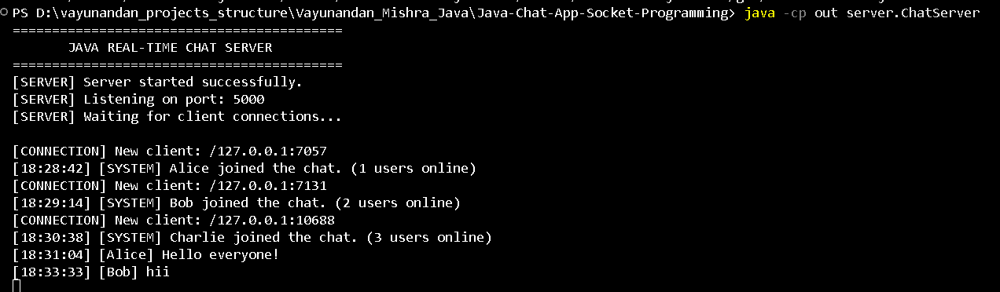
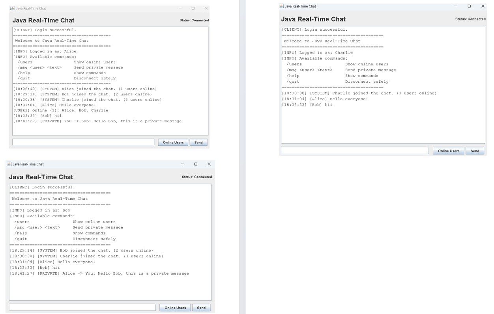
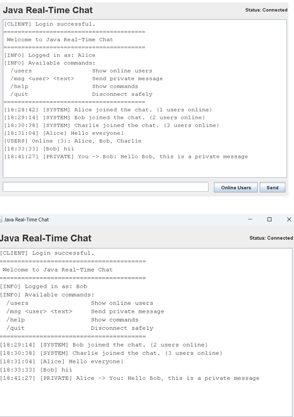
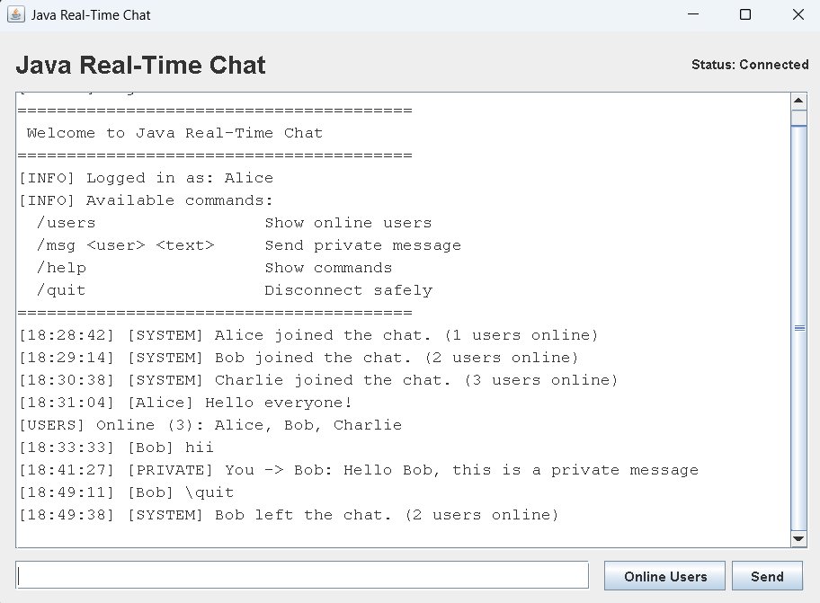
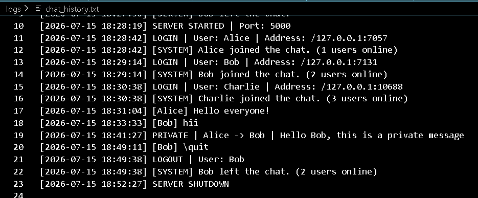
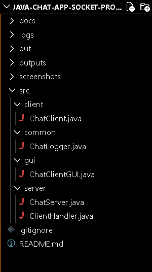

# 💬 Java Real-Time Chat Application

A feature-rich, real-time, multi-client chat application developed using **Java Socket Programming, TCP/IP Networking, Multithreading, Concurrent Programming, and Java Swing**.

The application follows a **client-server architecture** in which multiple users can connect simultaneously to a centralized server and communicate in real time. It supports public message broadcasting, private messaging, active-user tracking, join/leave notifications, timestamps, persistent chat logging, and both **Console** and **Swing GUI** clients.

This project was developed as an industry-oriented Java networking project to demonstrate practical knowledge of **Java, Socket Programming, Multithreading, Client-Server Communication, Concurrent Systems, GUI Development, and Real-Time Application Design**.

---

## 📌 Project Overview

Modern communication platforms require multiple users to exchange information simultaneously and reliably. This project demonstrates the fundamental architecture behind real-time messaging systems by implementing a centralized Java server capable of managing multiple concurrent client connections.

Each connected client communicates with the server using a **TCP socket connection**. The server assigns a dedicated client-handling task to every connected user and uses Java concurrency mechanisms to manage multiple connections simultaneously.

The project provides two client interfaces:

- **Console Client** — demonstrates the core socket communication mechanism.
- **Swing GUI Client** — provides a user-friendly desktop interface for real-time communication.

---

## 🎯 Project Objectives

The primary objectives of this project are to:

- Understand Java Socket Programming
- Implement TCP-based client-server communication
- Handle multiple clients concurrently
- Apply Java multithreading and concurrency concepts
- Implement real-time message broadcasting
- Support private user-to-user communication
- Manage connected users safely
- Implement graceful client disconnection
- Maintain persistent chat activity logs
- Build both console-based and graphical clients
- Develop a modular and maintainable Java application

---

## ✨ Key Features

### Core Features

- 🚀 Real-time client-server communication
- 🌐 TCP socket-based networking
- 👥 Multiple concurrent client connections
- 🧵 Multithreaded client handling
- 📢 Public message broadcasting
- 🔐 Private messaging between users
- 🟢 Active user tracking
- 👤 Unique username validation
- 📥 User join notifications
- 📤 User leave notifications
- ⏱️ Message timestamps
- 💾 Persistent chat history logging
- ⚠️ Input validation and error handling
- 🔌 Graceful client disconnection
- 🖥️ Console-based chat client
- 🪟 Java Swing graphical chat client
- 🔄 Console and GUI client interoperability

---

## 🛠️ Technology Stack

| Technology | Purpose |
|---|---|
| Java | Core application development |
| Java Socket API | Network communication |
| TCP/IP | Reliable client-server communication |
| `ServerSocket` | Server-side connection management |
| `Socket` | Client-server communication channel |
| `ExecutorService` | Concurrent client execution |
| Java Threads | Real-time message reception |
| `ConcurrentHashMap` | Thread-safe client management |
| `BufferedReader` | Receiving network messages |
| `PrintWriter` | Sending network messages |
| Java Swing | Desktop graphical user interface |
| Java I/O | Persistent chat logging |
| VS Code | Development environment |
| Git & GitHub | Version control and project hosting |

---

## 🏗️ System Architecture

The application follows a centralized client-server architecture.

```text
                     ┌─────────────────────┐
                     │     Chat Server     │
                     │   ServerSocket      │
                     │     Port 5000       │
                     └──────────┬──────────┘
                                │
                         TCP Connections
                                │
             ┌──────────────────┼──────────────────┐
             │                  │                  │
             ▼                  ▼                  ▼
      ┌─────────────┐    ┌─────────────┐    ┌─────────────┐
      │   Client 1  │    │   Client 2  │    │   Client 3  │
      │    Alice    │    │     Bob     │    │   Charlie   │
      └─────────────┘    └─────────────┘    └─────────────┘
             │                  │                  │
             └──────────────────┼──────────────────┘
                                │
                                ▼
                       ┌──────────────────┐
                       │ Client Handlers  │
                       │ ExecutorService  │
                       └────────┬─────────┘
                                │
                  ┌─────────────┼─────────────┐
                  ▼             ▼             ▼
              Broadcast      Private       Active
              Messages       Messages       Users
                                │
                                ▼
                       ┌──────────────────┐
                       │   Chat Logger    │
                       │ Persistent Logs  │
                       └──────────────────┘
```

---

## 🔄 Application Workflow

```text
User starts client
        │
        ▼
Connect to localhost:5000
        │
        ▼
Server accepts socket connection
        │
        ▼
ClientHandler assigned to client
        │
        ▼
User enters username
        │
        ▼
Server validates username
        │
        ▼
User joins chat
        │
        ├───────────────┐
        ▼               ▼
  Send Message     Execute Command
        │               │
        ▼        ┌──────┼───────┐
   ChatServer    ▼      ▼       ▼
        │      /users  /msg    /quit
        ▼
Broadcast to connected clients
        │
        ▼
Messages displayed in real time
        │
        ▼
Activity stored in chat log
```

---

## 🧵 Multithreading and Concurrency

Multithreading is one of the core concepts demonstrated by this project.

A chat server must communicate with several users simultaneously. If the server handled clients sequentially, one client's connection could block communication for every other user.

The application solves this using an `ExecutorService`.

```text
ChatServer
    │
    ├── ClientHandler → Alice
    │
    ├── ClientHandler → Bob
    │
    ├── ClientHandler → Charlie
    │
    └── ClientHandler → Additional Clients
```

Each client connection is processed independently, allowing multiple users to send and receive messages concurrently.

Thread-safe data structures are used to safely manage shared client information.

---

## 📡 Socket Programming

The server creates a `ServerSocket` and listens for incoming connections on port `5000`.

```java
ServerSocket serverSocket = new ServerSocket(5000);
```

Each client creates a socket connection to the server:

```java
Socket socket = new Socket("localhost", 5000);
```

Once connected, the client and server exchange messages through input and output streams.

The application uses **TCP**, which provides reliable and ordered communication between connected systems.

---

## 💬 Supported Commands

| Command | Description |
|---|---|
| `/users` | Display currently connected users |
| `/msg <username> <message>` | Send a private message |
| `/help` | Display available commands |
| `/quit` | Disconnect safely from the server |

### Private Message Example

```text
/msg Bob Hello Bob, this is a private message.
```

Only the sender and the specified recipient receive the private message.

---

## 📂 Project Structure

```text
Java-Real-Time-Chat-Application/
│
├── src/
│   ├── client/
│   │   └── ChatClient.java
│   │
│   ├── common/
│   │   └── ChatLogger.java
│   │
│   ├── gui/
│   │   └── ChatClientGUI.java
│   │
│   └── server/
│       ├── ChatServer.java
│       └── ClientHandler.java
│
├── docs/
│   ├── architecture.md
│   ├── execution-guide.md
│   └── testing.md
│
├── logs/
│   └── .gitkeep
│
├── outputs/
│   └── terminal_output.png
│
├── screenshots/
│   ├── chat-history-logging.png
│   ├── join-leave-notification.png
│   ├── multi-client-chat.png
│   ├── private-messaging.png
│   ├── project-structure.png
│   └── server-running.png
│
├── .gitignore
└── README.md
```

---

## ⚙️ Prerequisites

Before running the application, make sure you have:

- Java Development Kit (JDK) 17 or later
- VS Code, IntelliJ IDEA, Eclipse, or another Java-compatible IDE
- Java added to the system PATH

Verify the Java installation:

```bash
java -version
javac -version
```

---

## 🚀 Installation and Setup

### 1. Clone the Repository

```bash
git clone https://github.com/Vayu-143/Java-Real-Time-Chat-Application.git
```

Move into the project directory:

```bash
cd Java-Real-Time-Chat-Application
```

---

## 🔨 Compile the Project

From the project root directory, run:

```bash
javac -d out src/common/ChatLogger.java src/server/ChatServer.java src/server/ClientHandler.java src/client/ChatClient.java src/gui/ChatClientGUI.java
```

The compiled Java classes will be generated inside the `out/` directory.

---

## ▶️ How to Run

### Step 1 — Start the Chat Server

```bash
java -cp out server.ChatServer
```

Expected output:

```text
==========================================
       JAVA REAL-TIME CHAT SERVER
==========================================

[SERVER] Server started successfully.
[SERVER] Listening on port: 5000
[SERVER] Waiting for client connections...
```

Keep the server terminal running.

### Step 2 — Run the Swing GUI Client

Open a new terminal:

```bash
java -cp out gui.ChatClientGUI
```

Enter a username when prompted.

Run the command multiple times to simulate multiple users:

```bash
java -cp out gui.ChatClientGUI
```

Example users:

```text
Alice
Bob
Charlie
```

### Step 3 — Run the Console Client

The application also supports a console interface:

```bash
java -cp out client.ChatClient
```

GUI and console clients can communicate with each other through the same server.

---

## 🧪 Virtual Multi-Client Simulation

A real multi-user chat environment can be simulated entirely on a single computer.

```text
Terminal 1 → Chat Server

GUI 1      → Alice
GUI 2      → Bob
GUI 3      → Charlie

Terminal 2 → Optional Console Client
```

All clients establish independent TCP socket connections with the same server.

This demonstrates:

- Concurrent client handling
- Real-time broadcasting
- Independent socket connections
- Thread-safe user management
- Client interface independence

---

## 📸 Project Demonstration

### Server Running



The server listens for incoming TCP connections and manages connected clients.

---

### Multi-Client Real-Time Chat



Multiple clients can connect simultaneously and exchange messages in real time.

---

### Private Messaging



Users can communicate privately using the `/msg` command.

---

### Join and Leave Notifications



Connected users receive real-time notifications whenever another user joins or leaves the chat.

---

### Persistent Chat Logging



Server activities and chat events are stored persistently for monitoring and demonstration purposes.

---

### Project Structure



The project follows a modular package structure separating server, client, GUI, and common utility components.

---

## 🧪 Testing

The application was manually tested for the following scenarios:

| Test Scenario | Expected Result | Status |
|---|---|---|
| Server startup | Server starts on port 5000 | ✅ Passed |
| Single client connection | Client connects successfully | ✅ Passed |
| Multiple client connections | Multiple clients connect concurrently | ✅ Passed |
| Message broadcasting | Message reaches connected clients | ✅ Passed |
| Private messaging | Message reaches intended recipient | ✅ Passed |
| Active user tracking | Connected users are displayed | ✅ Passed |
| Duplicate username | Duplicate username is rejected | ✅ Passed |
| Invalid username | Invalid username is rejected | ✅ Passed |
| Invalid private-message user | Error message is displayed | ✅ Passed |
| Join notification | Connected users receive notification | ✅ Passed |
| Graceful disconnect | User leaves safely | ✅ Passed |
| Leave notification | Remaining users receive notification | ✅ Passed |
| Chat logging | Events are written to the log file | ✅ Passed |
| GUI and console interoperability | Both clients communicate successfully | ✅ Passed |

Detailed testing information is available in:

```text
docs/testing.md
```

---

## 📊 Sample Chat Flow

```text
[18:28:42] [SYSTEM] Alice joined the chat. (1 users online)
[18:29:14] [SYSTEM] Bob joined the chat. (2 users online)
[18:30:38] [SYSTEM] Charlie joined the chat. (3 users online)

[18:31:04] [Alice] Hello everyone!

[USERS] Online (3): Alice, Bob, Charlie

[PRIVATE] Alice -> Bob: Hello Bob!

[18:35:12] [SYSTEM] Charlie left the chat. (2 users online)
```

---

## 🔐 Error Handling and Validation

The application handles several common networking and user-input problems:

- Duplicate usernames
- Invalid username formats
- Empty messages
- Invalid commands
- Invalid private-message recipients
- Unexpected client disconnection
- Server connection failure
- Message-length validation
- Socket exceptions
- Server shutdown

These validations improve the stability and reliability of the application.

---

## 🏭 Industry Relevance

The concepts demonstrated in this project are foundational to many production systems, including:

- Real-time messaging platforms
- Customer support systems
- Multiplayer game servers
- Team collaboration applications
- Real-time notification services
- Distributed applications
- Network monitoring systems
- Enterprise communication platforms

Although production messaging systems use more advanced architectures, the fundamental concepts of **network connections, concurrency, message routing, session management, and reliable communication** remain highly relevant.

---

## ☕ Why Java?

Java remains widely used for enterprise and backend development because of its:

- Platform independence
- Mature networking APIs
- Strong multithreading support
- Rich concurrency utilities
- Object-oriented architecture
- Enterprise ecosystem
- Backend and cloud development capabilities

In the AI-driven software ecosystem, AI models still require reliable backend services, APIs, communication layers, databases, distributed systems, and scalable infrastructure. Java continues to play an important role in building these systems.

---

## 📚 Java Concepts Demonstrated

This project provides practical implementation experience with:

- Object-Oriented Programming
- Java Socket Programming
- `Socket`
- `ServerSocket`
- TCP/IP Networking
- Multithreading
- `Runnable`
- `ExecutorService`
- Concurrent Collections
- Thread Safety
- Input and Output Streams
- `BufferedReader`
- `PrintWriter`
- Exception Handling
- File Handling
- Java Swing
- Event-Driven Programming
- Client-Server Architecture

---

## ⚠️ Current Limitations

The current version is designed primarily for localhost and educational demonstration.

Current limitations include:

- No end-to-end encryption
- No persistent user accounts
- No database integration
- No offline message delivery
- No file transfer
- No multiple chat rooms
- No deployment on a public server

These features can be implemented in future versions.

---

## 🔮 Future Enhancements

Potential future improvements include:

- 🔑 User authentication and registration
- 🗄️ Database integration
- 🏠 Multiple chat rooms
- 📎 File sharing
- 😀 Emoji support
- 🔔 Desktop notifications
- 🟢 Enhanced online/offline status
- 🔒 TLS-encrypted communication
- 📜 Persistent message history
- 🌐 Remote server deployment
- 🔄 Automatic reconnection
- 🧪 JUnit automated testing

---

## 🎓 Learning Outcomes

Through this project, I gained practical experience in:

- Designing a client-server application
- Establishing TCP socket connections
- Handling multiple clients concurrently
- Applying Java multithreading concepts
- Managing shared resources safely
- Implementing real-time message broadcasting
- Building private-message routing
- Handling network exceptions
- Developing a Java Swing interface
- Implementing persistent application logging
- Structuring a modular Java project
- Testing multi-client network applications
- Using Git and GitHub for project documentation

---

## 📖 Documentation

Additional technical documentation is available in the `docs/` directory:

- `architecture.md` — System architecture and communication workflow
- `execution-guide.md` — Complete setup and execution instructions
- `testing.md` — Testing strategy and test cases

---

## 🤝 Contributing

This project was developed primarily as an educational and portfolio project. Suggestions and improvements are welcome.

If you would like to contribute:

1. Fork the repository.
2. Create a feature branch.
3. Make your changes.
4. Commit your improvements.
5. Submit a pull request.

---

## 👨‍💻 Author

### Vayunandan Mishra

Electronics and Communication Engineering (ECE) Student

Interested in software development, Java programming, networking, IoT, embedded systems, VLSI, and building practical engineering projects.

GitHub: [Vayu-143](https://github.com/Vayu-143)

---

## ⭐ Support

If you find this project useful for learning Java Socket Programming, Client-Server Architecture, or Multithreading, consider giving the repository a ⭐.

---

## 📄 License

This project is developed for educational and portfolio purposes.

---

<p align="center">
  <b>Built with Java ☕ | Socket Programming 🌐 | Multithreading 🧵 | Swing GUI 🖥️</b>
</p>

<p align="center">
  Developed by <b>Vayunandan Mishra</b>
</p>